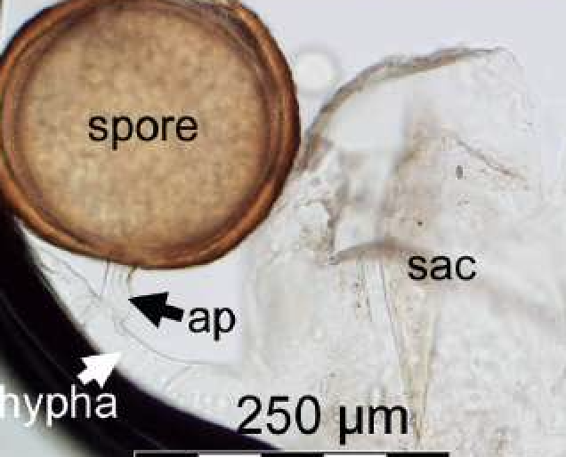
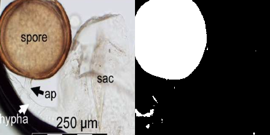

# 🔬 Segmentación de Esporas con U-Net

Este proyecto implementa una red neuronal **U-Net** en PyTorch para la segmentación semántica de esporas en imágenes.

El objetivo es clasificar cada píxel de una imagen como perteneciente a una "espora" o al "fondo", permitiendo identificar visualmente la presencia y extensión de las esporas. A continuación, se muestra un ejemplo de imagen original junto a su máscara binaria generada:

| Imagen original | Máscara generada manualmente| Máscara predicha con 25 imagenes de entrenamiento
|------------------|------------------|------------------|
|  |  | 
