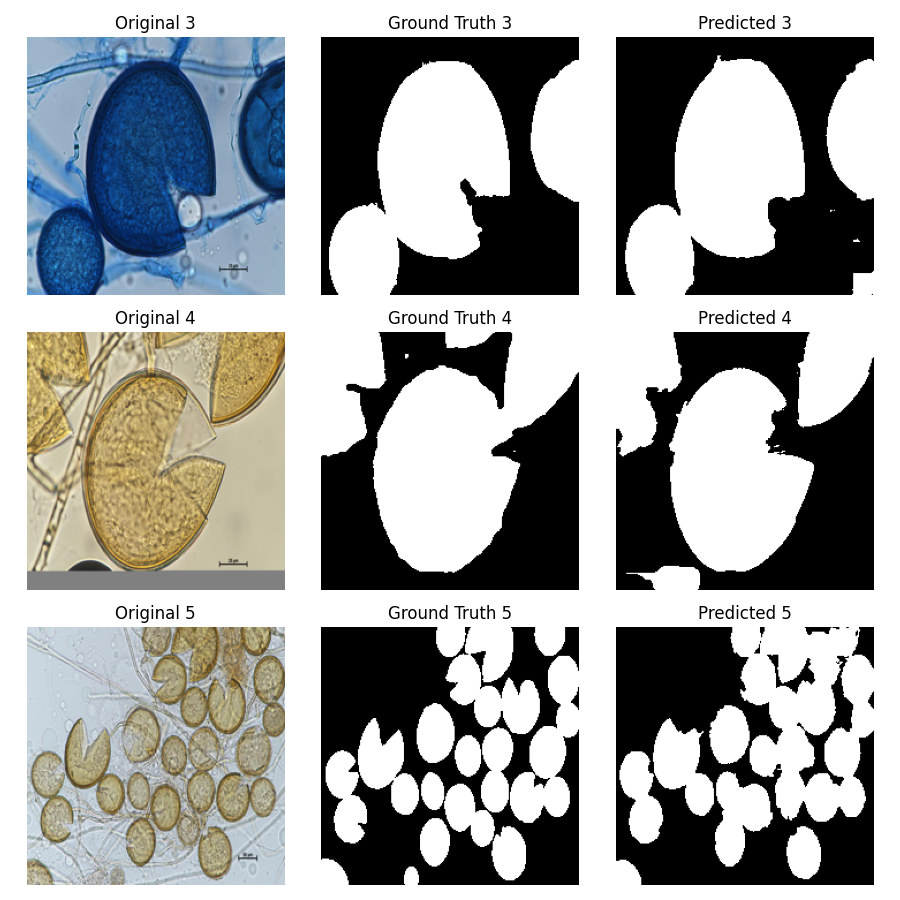

# 🔬 Segmentación de Esporas con U-Net

Este proyecto implementa una red neuronal **U-Net** en PyTorch para la segmentación semántica de esporas en imágenes.


El objetivo es clasificar cada píxel de una imagen como perteneciente a una "espora" o al "fondo", permitiendo identificar visualmente la presencia y extensión de las esporas. A continuación, se muestra un ejemplo de imagen original junto a su máscara binaria generada:


# DATASET
El conjunto de datos está compuesto por **203 imágenes** de esporas micorrízicas, junto con sus respectivas **máscaras binarizadas generadas manualmente**.

**Fuentes del dataset:**
- [Micorrizas-DataSet por AcWilliam002](https://github.com/AcWilliam002/Micorrizas-DataSet/tree/main)
- [dataset-micorrizas por arigdelgado](https://github.com/arigdelgado/dataset-micorrizas/tree/main)
- [Canadian Collection of Arbuscular Mycorrhizal Fungi (CCAMF)](https://agriculture.canada.ca/en/science/collections/canadian-collection-arbuscular-mycorrhizal-fungi-ccamf/catalogue-arbuscular-mycorrhizal-fungi-strains-available-glomeromycetes-vitro-collection)

# Dependencias
```bash
pip install torch torchvision matplotlib tqdm wandb pillow
```

# dataloader.py y unet.py
Contienen las clases necesarias para el manejo del dataset y la definición de la arquitectura U-Net, asi como metodos de carga y guardado.

# train_unet.py
Script principal para entrenamiento. Permite realizar sweeps de hiperparámetros con Weights & Biases (wandb) o entrenar el modelo directamente con una configuración específica.

# test_unet.py
Carga un modelo U-Net previamente entrenado y predice las máscaras binarizadas del conjunto de validación. Las predicciones se guardan en la carpeta predictions.

 